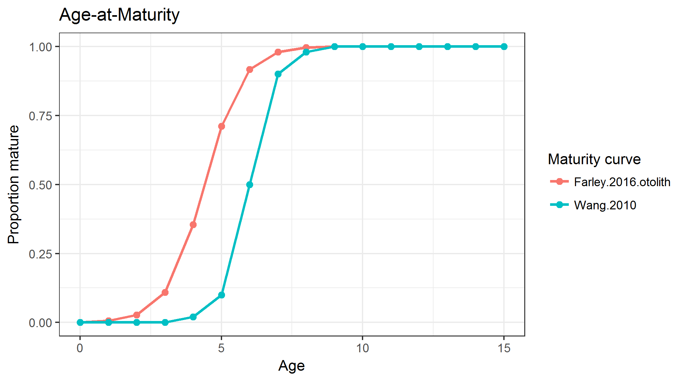
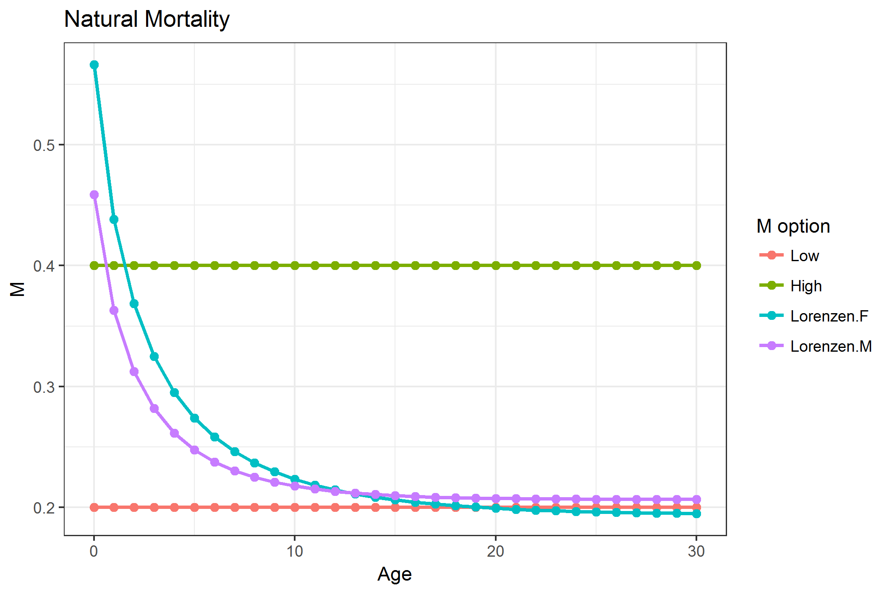
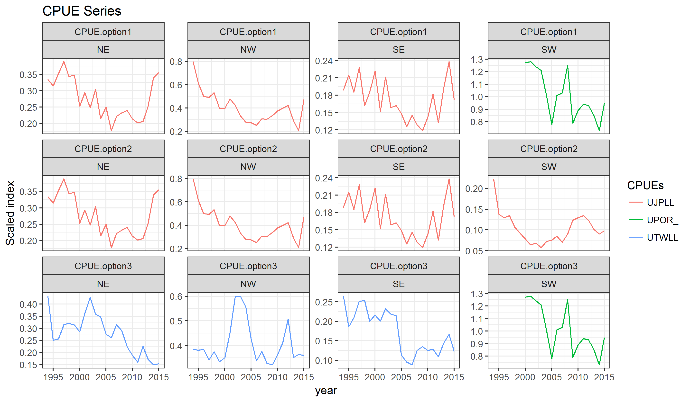

```{r, knitr, echo=FALSE, message=FALSE}
library(knitr)
opts_chunk$set(echo=FALSE, message=FALSE, warning=FALSE, cache=TRUE,
  fig.width=5, fig.height=3, fig.pos='H')
```

# Introduction

[@WPM2017]

@WPM2017

## Background
The Indian Ocean Tuna Commission (IOTC) has committed to a path of using Management Strategy Evaluation (MSE) to meet its obligations for adopting the precautionary approach. IOTC Resolution 12/01 *On the implementation of the precautionary approach* identifies the need for harvest strategies to help maintain stocks at levels consistent with the agreed reference points. Resolution 15/10, that superseded Resolution 13/10, provided a renewed mandate for the Scientific Committee to evaluate the performance of harvest control rules with respect to the species-specific interim target and limit reference points, no later than 10 years following the adoption of the reference points, for consideration of the Commission and their eventual adoption. A species-specific workplan was adopted at the 2017 IOTC meeting, outlining the steps required to adopt simulation-tested Management Procedures for the highest priority species, among them the Indian Ocean swordfish stock.

## SWO assessment

According to the results of the last stock assessment, shown in Figure 1 the biomass of SWO XXXXX 

OLD from ALB
has been slowly declining as catches increased over the 1950-2000 period, having probably fallen below the BMSY target at some point in the past. The stock then recovered, as a result of a decrease in catches after 2001, and is now considered to be around the target level of B = BMSY


# Structural uncertainty grid
The initial strategy to follow for the development of the SWO MSE platform were discussed by the WPM in 2017 (IOTC 2017a). It was agreed to use the stock assessment carried out and reviewed by the WPB in 2017 (IOTC 2017b) based on SS3 - Stock Synthesis 3.24z - CHECK VERSION (Methot and Wetzel 2013), as a basis for the population and fishery model to build the OM for this stock. Uncertainties concerning structural elements of the model formulation were considered to be the primary factor of concern.

The WPM proposed an initial grid of options for characterizing the structure of the uncertainty grid for generating the OM, based on a set of SS3 model runs (IOTC 2017a). During the 1st workshop meeting of the authors to start the conditioning of the OM, those were discussed. The decision was to construct a grid of model runs built around those suggested by the WPB on feasible, or at least not too extreme, values for a number of assumptions and fixed parameters in the population model. The impact of some of these elements in the model were already explored in some detail by the researchers carrying out past stock assessments (Fu, 2017).

The main points relevant to this preliminary OM are:
  i. OM-reference (OM-ref) derived from the 2017 SS3 SWO assessment model (SA-base) used for management advice;
  ii. Uncertainty in the OM grid as discussed below and shown further down in Table XX.


## Selectivity
Two distributions were considered for the fleets selectivity:

* Double Normal
* Logistic


## Steepness
Steepness (h) from Beverton and Holt stock-recruitment function is often a very influential parameter which is difficult to estimate or caractherize in most stock assessments. The base case SA models used 0.75, and the other options (0.6 and 0.9) reflect plausible uncertainty with lower and higher values. Three values for steepness were used:

* 0.6
* 0.75
* 0.9


## Growth & Maturity
Growth and maturity are very important parameters in stock assessments. Swordfish exhibit  a marked difference in growth between male and female, therefore sex-specific growth and maturity estimates are used. There are concerns in the age estimation of swordfish, with differences being found between the structures used to estimate age (fin rays or otoliths). This uncertainty also undermines the maturity by age relationship. Two growth curves and maturity estimates are considered for the preliminary OM:

* slow growth/late maturity  (Wang et al., 2010)
* fast growth/early maturity (Farley et al., 2016 - otoliths)

The Figs XXX and XXX below represent the options used for growth and maturity curves




## Natural Mortality M)
Natural mortality is a common unknown in most stock assessment models. The base case considered in the stock assessment model was 0.2 constant for all ages, which was supplemented with an alternative value of 0.4 also constant for all ages as suggested by the WPM. Additionally, after some additionaly considerations on the use of fixed versus age-specific M, the authors also decided to add a 3rd possibility using age-specific M values, based on the the Lorenzen equation. A total of 3 possibilities were therefore considered for M in this preliminary model grids:

* 0.2, constant for all ages
* 0.4, constant for all ages
* Age and sex specific values based on the Lorenzen equation

The Fig XXX below represents the options used for M  




## Efective Sampling Size (ESS)
Two values were used for the relative weight of length sampling data in the total likelihood, through changes in the efective sampling size parameter, of 2 and 20. This alters the relative weighting of length samples and CPUE series in informing the model about stock dynamics and the efects of fishing at length. The values of ESS used in the model grid were therefore:

* 2
* 20


## CPUE series
CPUE series presented to the WPB showed conflicting trends, the base case considered in the assessment used the Japanese late (1994-2015) CPUE with Portuguese indices from 2000-2015 being used in the Southwest. A total of 3 possibilities are considered for CPUE in this preliminary model grid, based on suggestions from the WPM:

* JPNlate+EU.PRT: Japanese CPUE (1994-2015) with indices 2000-2015 in the SW replaced by Portuguese index,
* JPNlate: Japanese CPUE (1994-2015),
* TWN+EU.PRT: Taiwanese CPUE (1994-2015) with indices 2000-2015 in the SW replaced by Portuguese index.

The Fig XXX below represents the options used for CPUE indexes  




## CPUE scaling
The conducted stock assessment considered a stock with four areas. Possible alternatives considered for scaling the CPUES were considered, noting that some options were already explored by the WPB during the stock assessment session and recomended by the WPM:

* area effect * surface
* Catch
* Biomass


## Catchability increase
Two scenarios were considered for the efective catchability of the CPUE fleet. On the first one it was assumed that the fleets have not improved their ability to fish for swordfish over time, or that any increase had been captured by the CPUE standardization process (0% increase). An alternative scenario considered a 1%/year increase in catchability by correcting the CPUE index to reflect this. The catchbility increase options considered therefore were:

* 0%
* 1%/year


## SigmaR
Two values were considered for the true variability of recruitment in the population (sigmaR), specifically 0.2 and 0.6, as set by the variable SR_sigmaR in the control file. The WPM discussed that both lower and higher options should be considered, but that a further middle value could also be added in the future (0.4). At this preliminary stage, and in order to not increase too much the grid of model runs, only the two extremes were considered for recruitment variability:

* SigmaR = 0.2
* SigmaR = 0.6

## Summary of the OM grid of uncertanties
Table XX below summarizes the grid of uncertanties considered for the conditioning of the OM. This initial grid results in a total of XXXX models. 
  
  
| Variable                  | Values                                         |                                                             |                                                                   |
|-----------------------|------------------------------------------------|-------------------------------------------------------------|-------------------------------------------------------------------|
| Selectivity               | Double Normal                                  | Logistic                                                    |                                                                   |
| Steepness                 | 0.6                                            | 0.75                                                        | 0.9                                                               |
| Growth + Maturity         | Slow growth, late maturity (Wang et al., 2010) | Fast growth, early maturity(Farley et al., 2016 - otoliths) |                                                                   |
| M                         | Low = 0.2                                      | High = 0.4                                                  | Sex-specific Lorenzen M(based on Farley et al. (2016) - otoliths) |
| ESS                       | 2                                              | 20                                                          |                                                                   |
| CPUE scaling schemes      | Area effect*Surface                            | Catch                                                       | Biomass                                                           |
| CPUEs                     | JPN late + EU.PRT                                  | JPN late                                                    | TWN + EU.PRT                                                          |
| Catchability increase     | 0%                                             | 1% / year                                                   |                                                                   |
| SigmaR                    | 0.2                                            | 0.6                                                         |                                                                   |
  

# Software Implementation

# Results

## OM conditioning

## Projections

- FLStock plot
- Histogram B0
- Conditional plots B0 ~ parameters

### Constant F=0

### Constant F2015

### Constant catch

# Discussion

## Next steps

# References

Fu, 2017 - SS3 SWO assessment

IOTC 2017a - WPM 2017 report

IOTC 2017b - WPB 2017 report

Methot, R.D.; Wetzel, C.R. 2013. Stock Synthesis: A Biological and Statistical Framework for Fish Stock Assessment and Fishery Management.
Fisheries Research 142, 86-99. 
