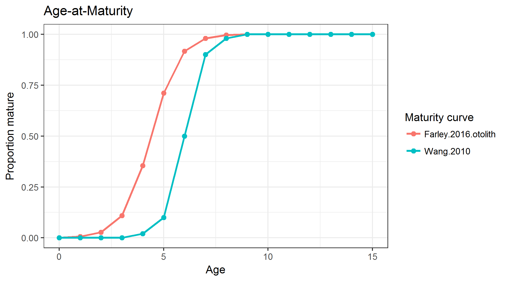
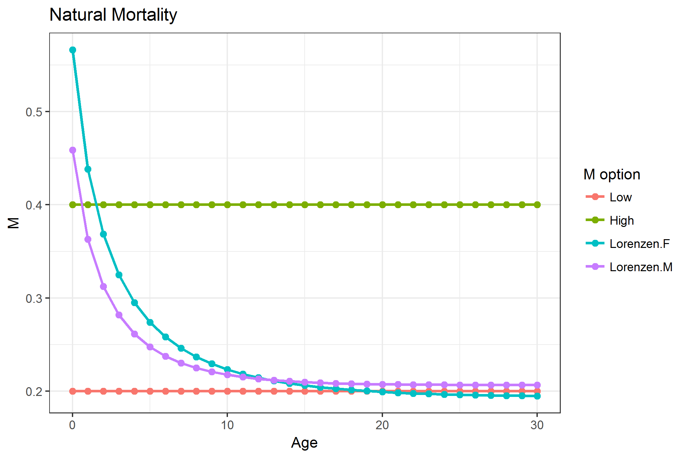
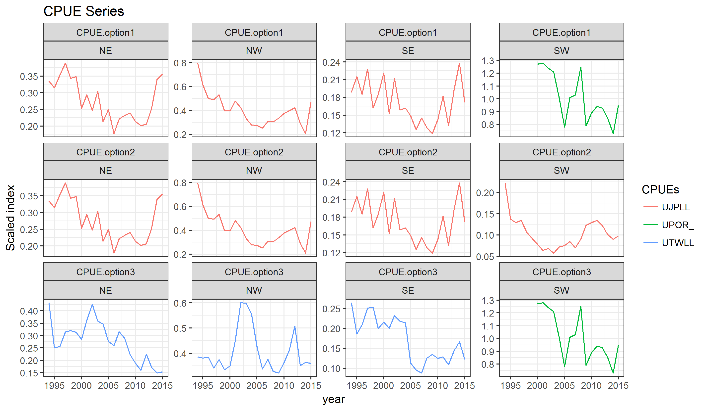

# Introduction

The Indian Ocean Tuna Commission (IOTC) has committed to a path of using Management Strategy Evaluation (MSE) to meet its obligations for adopting the precautionary approach. IOTC Resolution 12/01 *On the implementation of the precautionary approach* identifies the need for harvest strategies to help maintain stocks at levels consistent with the agreed reference points. Resolution 15/10, that superseded Resolution 13/10, provided a renewed mandate for the Scientific Committee to evaluate the performance of harvest control rules with respect to the species-specific interim target and limit reference points, no later than 10 years following the adoption of the reference points, for consideration of the Commission and their eventual adoption. A species-specific workplan was adopted at the 2017 IOTC meeting [@IOTC2017], outlining the steps required to adopt simulation-tested Management Procedures for the highest priority species, among them the Indian Ocean swordfish stock.

The recent session of the IOTC Working Party on Methods (WPM) [@WPM2017] discussed and proposed an initial set of elements likely to be responsible for most of the model uncertainty, both in past dynamics and current stock status. The structural uncertainty in the model formulation is likely to be larger than both observation and estimation uncertainty, although the relative importance of those other two sources of uncertianty should also be explored in the future.

# SWO assessment

The OM being developed here is based of the population and fishery models used for the assessment of the stock status of Indian Ocean swordfish [@Fu2017], presented at this year's session of the Working Party on Billfish (WPB). The Stock Synthesis 3 [@Methot2013SS3] population model is age-based (with ages 0-30), separated by sex, and partitioned into four areas. Information from 12 fisheries, defined by fleet and region, was used, including length composition data for eight of them. Standardized CPUE series exist for five longline fleets across areas. For complete details of the model please refer to @Fu2017 and @WPB2017.

The stock assessment explored the uncertainty with respect to various assumptions through a grid of 162 model runs, based around three CPUE combinations plus alternarive values for growth, natural mortality, stock-recruit steepness, variance in recruitmentr deviates, and effective sample size of the length composition data. All of these elements have been incorporated in the grid developed by WPM.

A summary of the population trajectories estimated by the model used as base for the assembling of the OMN grid, `io4_NTP_h75_GaMf_r2_CL020`^[This is a four area model, with both the Japanese and Portuguese CPUEs, steepness of 0.75, slow growth, recruitment sigmaR=0.2, effective LF sample size capped at 20] can be found in Figure \ref{fig:sa}.

\begin{figure}[hbt]

{\centering \includegraphics[width=0.5\linewidth]{IOTC-2017-SC20-11_files/figure-latex/sa-1} 

}

\caption{Population trajectories (recruitment, SSB, catch and F) estimated by the 2017 SS3 stock assessment of Indian Ocean swordfish.}\label{fig:sa}
\end{figure}

# Structural uncertainty grid

The recent session of the WPM proposed an initial set of options for characterizing the structure of the uncertainty grid for generating the OM, based on a set of SS3 model runs [@WPM2017]. During the 1st workshop meeting of the authors to start the conditioning of the OM, those were discussed. The decision was to construct a grid of model runs built around those suggested by the WPB on feasible, or at least not too extreme, values for a number of assumptions and fixed parameters in the population model. The impact of some of these elements in the model were already explored in some detail by the researchers carrying out past stock assessments [@Fu2017].

## Selectivity

Two functions were considered for the selectivity-at-length of the CPUE fleets: the current *double normal*, in which selectivity decreases in the older ages, and a *logistic* function, in which selectivity remains flat after reaching its assymptote.

## Steepness
Steepness (h) from Beverton and Holt stock-recruitment function is often a very influential parameter which is difficult to estimate in most stock assessments. The base case SA models used *0.75*, and the other options (*0.6* and *0.9*) reflect plausible lower and higher values.

## Growth & Maturity
Growth and maturity are very important parameters in stock assessments. Swordfish exhibit a marked difference in growth between male and female, therefore sex-specific growth and maturity estimates are used in all cases. There are concerns in the age estimation of swordfish, with differences being found in the results depending omn what structure is used to estimate age (fin rays or otoliths). This uncertainty also undermines the maturity by age relationship. Two growth curves and maturity estimates are considered for the preliminary OM (Figure \ref{fig:matgrow}):

- Slow growth and late maturity  (Wang et al., 2010)
- Faster growth and earlier maturity (Farley et al., 2016, from otoliths)

{width=65%}

## Natural Mortality M)
Natural mortality is a common unknown in most stock assessment models. The base case considered in the stock assessment model was 0.2 constant for all ages, which was supplemented with an alternative value of 0.4 also constant for all ages as suggested by the WPM. Additionally, after some additionaly considerations on the use of fixed versus age-specific M, the authors also decided to add a 3rd possibility using age-specific M values, based on the the Lorenzen equation. A total of 3 possibilities were therefore considered for M in this preliminary model grids (Figure \ref{fig:m}:

* 0.2, constant for all ages
* 0.4, constant for all ages
* Age and sex specific values based on the Lorenzen equation

At the moment, only the first two have been implemented.

{width=65%}

## Efective Sampling Size (ESS)
Two values were used for the relative weight of length sampling data in the total likelihood, through changes in the efective sampling size parameter, of 2 and 20. This alters the relative weighting of length samples and CPUE series in informing the model about stock dynamics and the efects of fishing at length.

## CPUE series
CPUE series presented to the WPB showed conflicting trends, specially in the final years of the series. The base case considered in the assessment used the Japanese late (1994-2015) CPUEs, with the Portuguese indices from 2000-2015 being used in the Southwest area. An alternative view could be gemnerated by usingh the Taiwanese CPUEs, again nincombination with those from the Portuguese fleet for the SW. A total of 3 possibilities are thus being considered for CPUE series in this preliminary model grid (Figure \ref{fig:cpues}), based on suggestions from the WPM [@WPM2017]:

* *JPNlate + EU.PRT*: Japanese CPUE (1994-2015) with indices 2000-2015 in the SW replaced by the Portuguese index,
* *JPNlate*: Japanese CPUE (1994-2015) for all areas,
* *TWN + EU.PRT*: Taiwanese CPUE (1994-2015) with indices 2000-2015 in the SW replaced by the Portuguese index.

{width=65%}

## CPUE scaling
The conducted stock assessment considered a stock with four areas. Possible alternatives considered for scaling the CPUES were also considered, noting that some options were already explored by the WPB during the stock assessment session and recomended by the WPM:

* *area* effect * surface
* *catch* by area
* *biomass* by area, as estimated from a four area model with no scaling

## Catchability increase
Two scenarios were considered for the efective catchability of the CPUE fleet. On the first one it was assumed that the fleets have not improved their ability to fish for swordfish over time, or that any increase had been captured by the CPUE standardization process (0% increase). An alternative scenario considered a 1%/year increase in catchability by correcting the CPUE index to reflect this.

## SigmaR
Two values were considered for the true variability of recruitment in the population (*sigmaR*), specifically 0.2 and 0.6, as set by the variable `SR_sigmaR` in the SS3 control file. The WPM discussed that both lower and higher options should be considered, but that a further middle value could also be added in the future (0.4) [@WPM2017]. At this preliminary stage, and in order to not increase too much the grid of model runs, only the two extremes (0.2 and 0.6) were considered for recruitment variability.

## Summary of the OM grid of uncertanties
Table 1 below summarizes the grid of uncertanties considered for the conditioning of the OM. This initial grid results in a total of 1,296 model runs. Of this, 864 have already been carried out as one of the natural mortality options, and the alternative selectivity scenario, are yet to be implemented.
 
Table: Summary view of the swordfish operating model grid. 
  
| Variable                  | Values                                         |                                                             |                                                                   |
|---------------------------|------------------------------------------------|-------------------------------------------------------------|-------------------------------------------------------------------|
| Selectivity               | Double Normal                                  | Logistic                                                    |                                                                   |
| Steepness                 | 0.6                                            | 0.75                                                        | 0.9                                                               |
| Growth + Maturity         | Slow growth, late maturity (Wang et al., 2010) | Fast growth, early maturity (Farley et al., 2016, otoliths) |                                                                   |
| M                         | Low = 0.2                                      | High = 0.4                                                  | Sex-specific Lorenzen *M* (Farley et al. (2016), otoliths)        |
| ESS                       | 2                                              | 20                                                          |                                                                   |
| CPUE scaling schemes      | Area effect x Surface                          | Catch                                                       | Biomass                                                           |
| CPUEs                     | JPN late + EU.PRT                              | JPN late                                                    | TWN + EU.PRT                                                      |
| Catchability increase     | 0%                                             | 1% / year                                                   |                                                                   |

# Software Implementation

The software that has been developed for conditioning of the SS3-based OM for Indian Ocean albacore [@Mosqueira2017ALBWPM] has been extended to work on the model structure applied to swordfish. An R package, based on the FLR Project R library for quantitative fisheries science [@KellM07FLR] is being developed ^[Currently hosted at <https://github.com/iotcwpm/SWO/tree/master/ioswomse>] containing all the code for ther MSE work on this stock: condition the OM, load and inspect the results, and future projections and simulations.

# Results

Although the OM conditoning exercise is still incomplete, an initial exploration of results is likely to shed some light on the levels of uncertainty the proposed grid will provide, as well as on problematic  areas of the grid: combinations of parameters leading to unreasonable or surprising results. The time series plot of the complete grid of runs shows values for abundance and fishing mortality to be widely distributed (Figure \ref{fig:plotom}). The median values for both SSB and recruitment are difficult to discern in this figure given the level of the upper boundary of estimated abundances.

Conditioning of the albacore OM had to confront the problem of runs estimating very large values of virgin biomass to explain the observed catch levels and abundance trends when the imposed model parameters led to low stock productivity. The distribution of estimates for virgin biomass in the current OM grid (Figure \ref{fig:histvb}) are concentrated, in decreasing numbers, around three values. The last two groups deviate markedly from the first, where the estimate arising from the base case falls.

\begin{figure}[hbt]

{\centering \includegraphics[width=0.5\linewidth]{IOTC-2017-SC20-11_files/figure-latex/histvb-1} 

}

\caption{Log scale distribution of the 864 estimated values of virgin biomass. The red line show the value returned by the base case model run.}\label{fig:histvb}
\end{figure}

These large estimates appear to originate from the combination of two elements in the grid (Figure \ref{fig:plotcond}), the scaling by area of the CPUEs and the CPUE used, sometimes helped by the choice of catchability hypothesis.

\begin{figure}[hbt]

{\centering \includegraphics[width=0.5\linewidth]{IOTC-2017-SC20-11_files/figure-latex/plotcond-1} 

}

\caption{Boxplot of values for virgin biomass estimated by models with each of the three scaling scenarios (area, biomass and catch) and CPUE series (Japanese only, jap, Japanese and Portuguese, jappt, and Taiwanese and Portuguese, twnpt. The red line shows the value returned by the case base run.}\label{fig:plotcond}
\end{figure}

The effect of such large biomass estimates is apparent when compared with the current stock status they provide (Figure \ref{fig:compare}). Starting from those large abundances naturally leads to stocks that remain at very close to virgin levels, despite the long history of exploitation.

\begin{figure}[hbt]

{\centering \includegraphics[width=0.5\linewidth]{IOTC-2017-SC20-11_files/figure-latex/compare-1} 

}

\caption{Estimates of virgin biomass (in log scale) vs. current (2015) depletion levels for all 864 model runs.}\label{fig:compare}
\end{figure}

It seems clear that the final grid of runs should not include those runs starting from biomasses above a certain level, still to be determined, as they will not provide an useful testing ground on which to test management procedures for the Indian Ocean swordfish stock. Filtering out those runs were virgin biomass is greater than 1.5 Mt, in this case for testing purposes, would lead to a different view of the history of stock (Figure \ref{fig:filterom}). A total of 576 model runs would remain if this filter is applied.

\begin{figure}[hbt]

{\centering \includegraphics[width=0.5\linewidth]{IOTC-2017-SC20-11_files/figure-latex/filterom-1} 

}

\caption{Population trajectories (recruitment, SSB, catch and F) estimated by the filtered OM grid for Indian Ocean swordfish, containing only runs in which $B_0 < 1,5 Mt$. The black line shows the median value, while the darker and lighter ribbons show the 50\% and 90\% quantiles, respectively.}\label{fig:filterom}
\end{figure}

<!--
## Projections

- FLStock plot
- Histogram B0
- Conditional plots B0 ~ parameters
### Constant F=0
### Constant F2015
### Constant catch

-->

# Discussion

This short document has introduced the first version of an operating model for the Indian Ocean stock of swordfish. The OM is built by introducing multiple sources of structural uncertainty to the stock assessment model conducted by WPB [@WPB2017] and based on the Stock Synthesis 3 platform [@Methot2013SS3]. The elements in the uncertainty grid have been proposed by the last session of the WPM [@WPM2017] and extend those already considered by the authors of the stock assessment [@Fu2017]. One element in that grid (Table 1) has not yet been incorporated, so the current results are still partial and preliminary.

A number of model runs appear to introduce unreasonable combinations of parameters and data, and thus lead to estimates of virgin biomass that should be considered feasible. Although the factors and their levels that lead to those results have been identified, further analysis is required to understand the chain of events to bring the model into estimating those values. Some subjective filter of values that should be included in the base case OM might be required.

## Next steps

Progress on the MSE work for swordfish will continue, with the limits imposed by the available time and personal resources. In brief, the short-term workplan will consist of the following tasks:

- Finalize the OM grid by incorporating the alternative CPUE selectivity and M scenarios.
- Carry out a detailed revision of the code generating the grid of SS3 models.
- Compute an initial set of reference projections: constant catch and constant F.
- Compare the levels of variability due to paramneter uncertainty, estimatred thorugh Markoc chain Monte Carlo (McMC) with those ariusing from structural uncertainty.

Work on this MSE exercise is being carried out around a public source code repository, available at <https://github.com/iotcwpm/SWO>. As work progresses, instructions will be made available for interested parties to install the necessary R packages and explore the results.

# References
